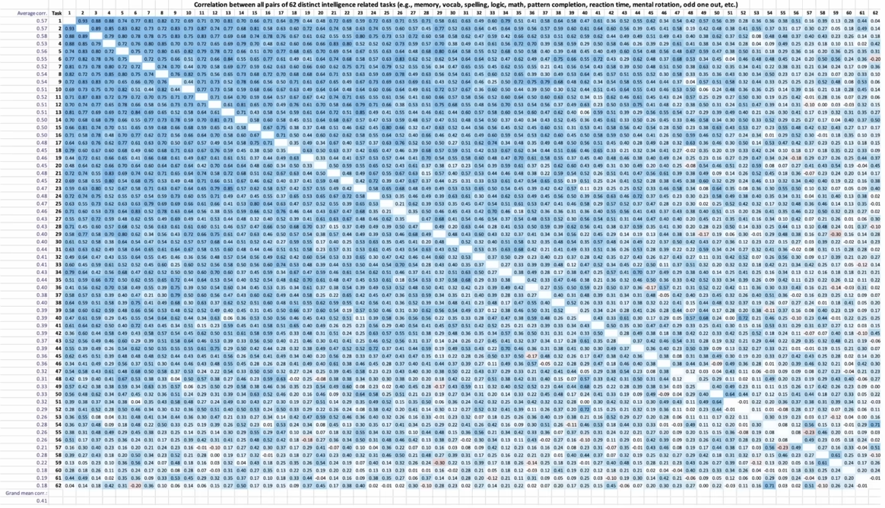

The general intelligence factor, *g* for short, is a latent variable that explains about half of the variance in intelligence.

Its construction stems from the positive manifold--the fact that cognitive subtest results are positively correlated.

It is constructed through [[Factor analysis]]. It is a population-level latent variable and is not defined for individuals. It is however possible to construct [[IQ]] tests that are heavily *g*-loaded.

Some items are more *g*-loaded than others. Strongly *g*-loaded subtests include Raven's progressive matrices, matrix reasoning, backward digit span memorization--while weakly *g*-loaded subtests include reaction time, spelling, forward digit span memorization.
